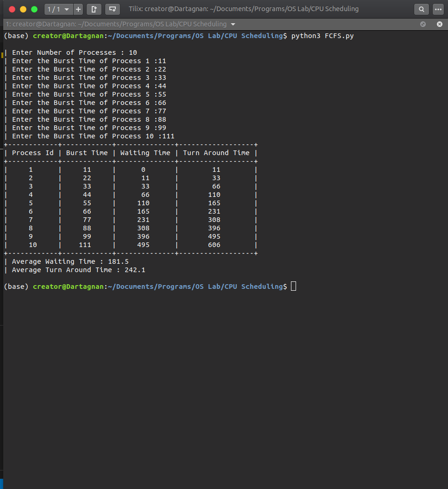
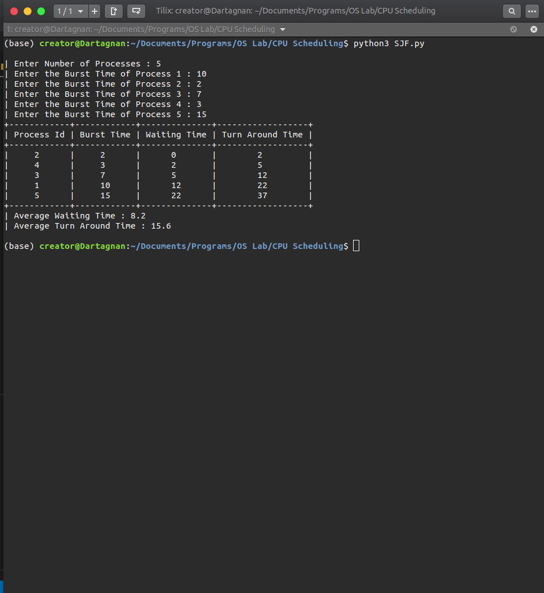
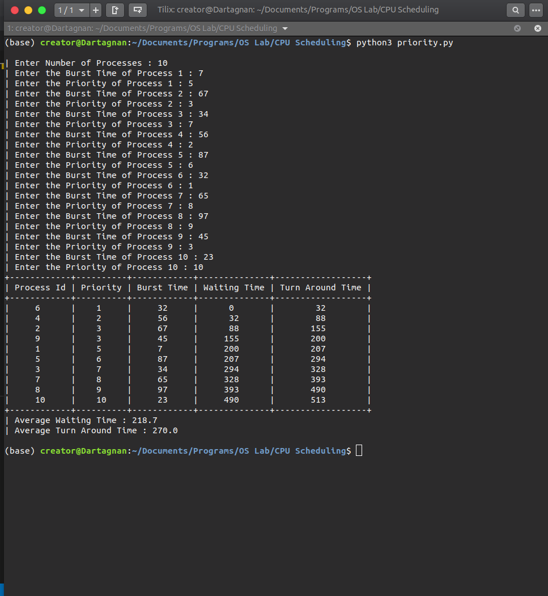
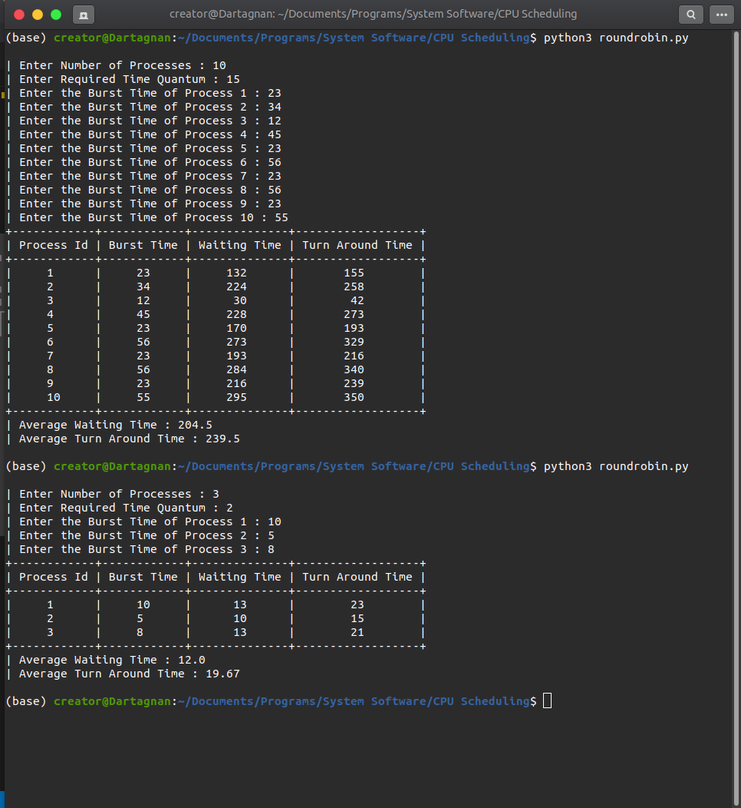

# CPU Scheduling Algorithms

- [FCFS Scheduling](https://github.com/rahulrmsh/system-software/blob/master/CPU%20Scheduling/FCFS.py)
- [SJF Scheduling](https://github.com/rahulrmsh/system-software/blob/master/CPU%20Scheduling/SJF.py)
- [Priority Scheduling](https://github.com/rahulrmsh/system-software/blob/master/CPU%20Scheduling/priority.py)
- [Round Robin scheduling](https://github.com/rahulrmsh/system-software/blob/master/CPU%20Scheduling/roundrobin.py)

| FCFS Scheduling | SJF Scheduling | Priority Scheduling | Round Robin scheduling
| --- | --- | --- | --- |
|  |  |  |  |
