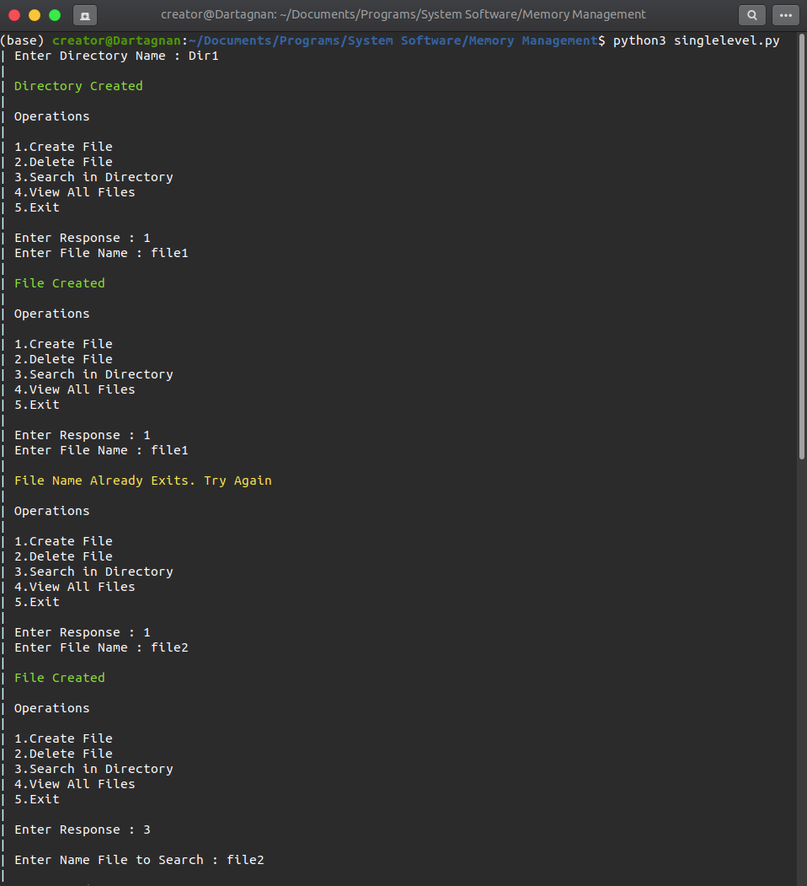
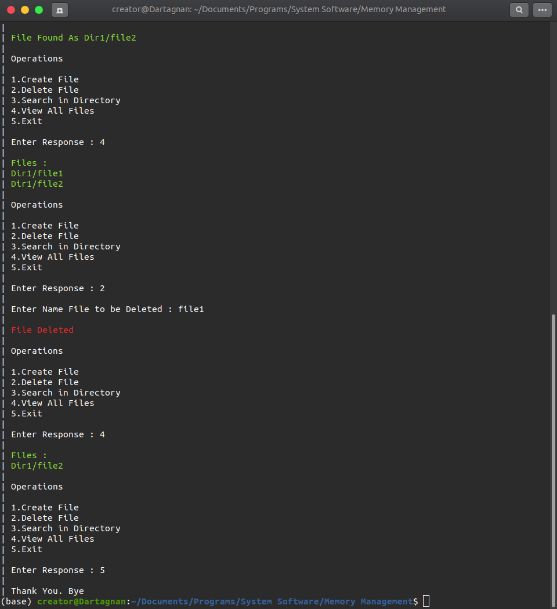

# Memory Management

- [Single Level](https://github.com/rahulrmsh/system-software/blob/master/Memory%20Management/singlelevel.py)
- [Two Level](https://github.com/rahulrmsh/system-software/blob/master/Memory%20Management/twoLevel.py)
- [Hierarchical](https://github.com/rahulrmsh/system-software/blob/master/CPU%20Scheduling/priority.py)

| Single Level | Two Level | Hierarchical |
| --- | --- | --- | 
|  |  |  |
|  |  |  |